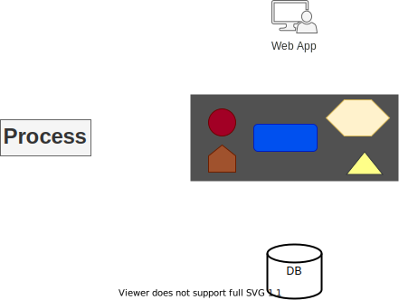
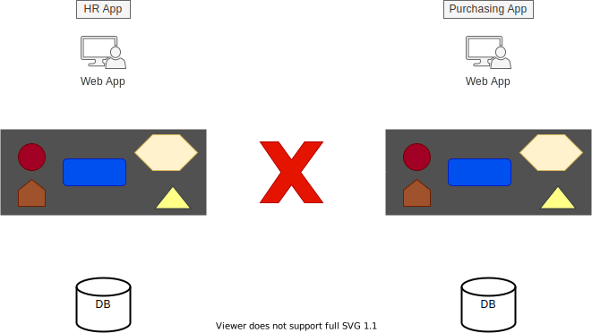

> # <mark>`Microservices Architecture`</mark>

# History of Microservices

`Microservices are a result of problems with two architecture paradigms:`

1.  **Monolith**
1.  **SOA**

---

## `Monolith Architecture`

-   The original architecture, the ancestor of all the other architectures we have today.
-   There are a lot of applications that are still in monolith architecture.
    -   This is not a bad thing, because some scenarios are best suited for monolith architecture.
-   All software components are executed in a single process.
    -   All the components share the same memory, compute power and no distribution of any kind.
-   Strong coupling between all classes
    -   The code pieces being tightly coupled, there is nothing that separates them from one another.
-   Usually implemented as Silo
    -   It's a standalone application, that does not share anything with other applications [data, functionality or API].
-   Example:

    -   `HR App`  

        

 

    -   Here, the HR app is a single process, comprising of all the components of the application.
    -   Thus making the app a monolith without any distribution.
    -   A monolith application may not always have one and only one process. Quite often they have a database, which is usually another process unless it's a in-memory database.
    -   And, in cases of web-applications, the user interface is also usually running on a separate machine, that has separate process.
    -   Yet, this is called a monolith as the core of the application involved is a single process.
    -   Consider a similar monolith called **Purchasing App** that has to be integrated with **HR App**

        -   Unfortunately, this is not possible because monoliths are often silos and do not expose ways to share data and functionality (Could be achieved, but not an easy process)  

        

 

> ### Monolith Architecture Pros

-   `Easier to design`
    -   No network-hops, messaging mechanisms / queues, no cross-process dividing
-   `Performance`
    -   No network-hops, no serialization & de-serialization layers

---

## `SOA`

-   First coined in 1998
-   Apps are considered services exposing functionality to the outside world
    -   As monoliths are silos, with SOA it's the other way around
-   Services expose metadata to declare their functionality
-   Usually implemented using SOAP & WSDL
    -   SOAP is a protocol for Web Services and it's basically a long and complicated XML document
    -   WSDL is another XML document containing the metadata about the service like what parameter they expect and what data they return
-   Usually implemented with ESB <small>[Enterprise Service Bus]</small>
-   Example:

    -   `SOA`:  

        

 

> ### SOA Pros

-   `Sharing data & functionality`
    -   Allowed sharing of data & functionality for the first time between systems
        in an easy, standard and platform agnostic way
-   `Polyglot between services`
    -   Helps avoid platform dependency
    -   As communications between services are done using standard protocols like SOAP & WSDL
        it is not actually important to know what platform the service is developed in.
        And for the first time a Java service could communicate with a .NET service.

---

[PREV](../../intro.md)  [NEXT](../02/02-problems-with-monolith-and-SOA.md)
