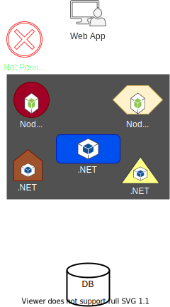

> # <mark>`Microservices Architecture`</mark>

# Problems with Monolith and SOA

`A lot of problems were found in both paradigms, problems related to technology, deployment, cost and more`

### `Problems with Monolith Architecture`

> ### (1) Single Technology Problem

-   All components must be developed using the same development platform.
-   Since monolith is considered to be a single process application,
    there is no way to develop various components of it in different platforms. So it is not always the best for the task.
    -   Sometimes it is a good idea to use more than one development platform in a single application, especially when there are specific capabilities of the platform that can be in used in the application.
-   Can't use specific platform for specific features and are tied to initial choice.
    -   Example:
        -   if our app is developed using NodeJS, which is good at handling short web-requests.
        -   we get a new requirement to handle documents, which is something that NodeJS do not excel at, then we have a problem and we will have to use NodeJS even thought platforms such as .NET are much better for this specific task.
-   Future upgrade of the technology is a problem, will have to upgrade he whole app.

    

 

> ### (2) Inflexibility Deployment

-   With monolith, new deployments are always for the whole app.
-   No way to deploy only part of the app.
-   Even when updating only one component, the whole codebase is deployed.
    -   Forces in rigorous testing for every deployment, inturn forces long development cycles.

> ### (3) Inefficient Compute Resources

-   With monolith, compute resources (CPU and RAM) are divided across all components.
-   If a specific component needs more resources, there is no way to do that.

> ### (4) Large and Complex

-   With monolith, the codebase is large and complex.
-   Little change can affect other components.
-   Testing not always detects all the bugs.
-   Difficult to maintain.
-   Might make the system obsolete.

---

### `Problems with SOA`

> ### (1) Complicated and Expensive ESB

-   With SOA, the ESB is one of the main components and is responsible for all the communication between all the services.
    -   Including routing, validation, authentication, aggregation and more.
    -   Without which the services will have more work to do.
-   This can quickly become bloated and expensive.
-   ESB tried to do everything, which doesn't end well.
-   Very difficult to maintain.

> ### (2) Lack of Tooling

-   For SOA to be effective, short development cycles were needed and allow for quick testing and deployment.
    -   But, no tooling existed to support this, and this took a lot of time now since testing SOA is more complicated than testing a monolith.
-   No time saving was achieved, and took more time than monolith.
