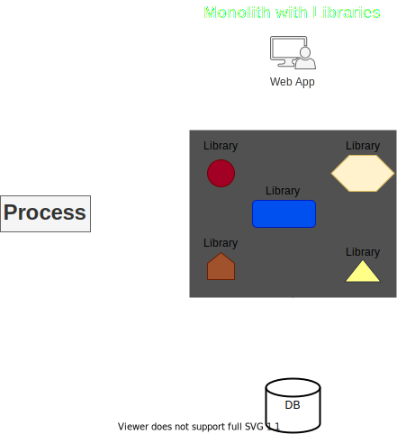
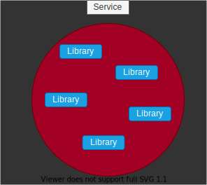

> # <mark>`Microservices Architecture`</mark>

# Microservices Architecture

> 1.  ### Componentization via services

-   Modular design is always a good idea
-   Components are the parts that together compose the software
-   Modularity can be achieved using:
    1.  `Libraries:`
        -   External code files that are called directly within the process,
            usually after declaring them using the keywords such as `import, require or using`.
        -   The libraries are executed within our systems process, share the same compute resources.
        -   They do not need any kind of mediation, such as `serializer or network` in order to be used.
        -   One of the benefits of using libraries is great performance.
    1.  `Services:`
        -   These are out of process components and are called using out-of-process mechanisms such as `Web API, RPC`.
        -   Modern systems mainly use modern Web APIs such as `REST`.
-   In Microservices, we prefer to implement the modular design using services (not libraries) for the componentization.
-   The componentization, which is a process of separating the software into different components, thus making it modular
    is preferably done using services and not libraries.
-   Libraries can and should be used inside the services, but in this case, they are part of the service and do not represent the whole componentization of the software, just the service itself.
-   `Monolith with Libraries:`  

    

 

-   `In microservices, componentization done via services:`

    -   Every component is a service, it runs in it's own process and is accessible using one of the process mechanisms such as `Web API or RPC`.  

    

 

-   Focusing on a specific service, we can see that it often has libraries, using libraries is a best practice and it is highly recommended.

    -   The only thing to remember regarding microservices is that libraries are not used to make the whole system modular, but they help with the inner workings of the service itself.
    -   The modularity of the system is expressed by the service and this is called componentization by service.  

        

 

> **Motivation:**

-   `Using services makes our components independently deployable:`
    -   If we want to modify a single component, we deploy this single component.
    -   If a component id a library, we will have to deploy the whole application again because the whole application runs in a single process.
-   `Using services as a component forces us to define the components interface very well:`
    -   If we are going to expose a component to the outer world as a web API, then we have no choice other than design a much better web API.

---

[PREV](../03-microservices-architecture.md)  [NEXT](../03B/03B-business-capabilities.md)
