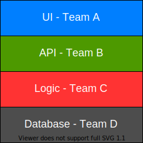
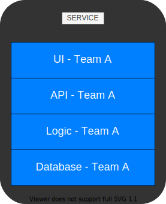

> # <mark>`Microservices Architecture`</mark>

# Microservices Architecture

> 2.  ### Organized around business capabilities

`Traditional projects have teams with horizontal responsibilities - UI, API, Logic, DB etc`  

 

Each layer is under the responsibility of a different team. Of course, the actual number of layers might change but this is the common case. 
The problem here is:

-   The slow, cumbersome inter-group communication.
-   Different goals for teams.

`With Microservices, every service is handled by a single team, responsible for all the aspects.`  

 

-   All the layers are handled and maintained by a single team, responsible for everything i.e., the UI, the API, logic, database and in fact any other aspect that they may have.
-   And, when we work like that, the team has only one goal, to make the service perform its functionality as best as possible.
-   Since the team has a holistic view of the service, it can ake decisions that affect the whole functionality of the service such as:
    -   Adapt the UI to the API.
    -   Change the database schema to make it more effective.
-   We might not see inner politics that might damage the overall service and no short sighted decisions.
-   The team has one goal, that is to make the best service possible and it's aligned with the goal.

 

`How do we decide on the boundaries of a service?`

`in other words, how do we decide what a service should do?`

`How do we know when one service ends and the other one begins?`

**So, with microservices, it's done by looking at business capabilities.**

-   We look at the overall functionality of the system and map the various business capabilities it has.
-   For example, an e-commerce app will probably have order management, inventory management, shopping basket, payment handling and so on.
    -   So, considering the order management service, which contains all of the technological layers and is handled by a single team.
    -   And thus, we have a single team, responsible for a single business capability.
-   Doing it this way, instead of having horizontal teams responsible for many business capabilities will help making the service better and with great time to market.

> **Motivation:**

-   `Quick Development:`
    -   It contributes to the quick development of the service by avoiding long and cumbersome inter-group communication.
        And the team is much more effective.
-   `Well-defined boundaries:`
    -   When defining service around business capabilities, we get a service with well-defined boundaries.
        It's quite clear as to what needs to be included and more importantly, what should not be included in the service.
    -   Keeping the service laser focused on its business capabilities makes its design easier and working with it a lot simpler.

---

[PREV](../03A/03A-componentization.md)  [NEXT](./03B-business-capabilities.md)
