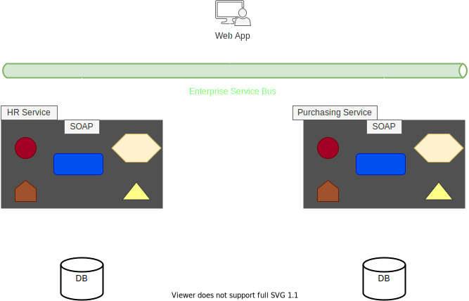
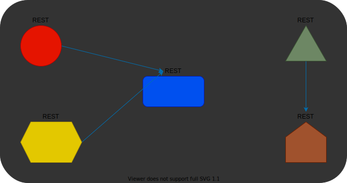

> # <mark>`Microservices Architecture`</mark>

# Microservices Architecture

> 4.  ### Smart endpoints and dumb pipes

`Traditional SOA projects used two complicated mechanisms:`

1.  `ESB - Enterprise Service Bus`
    -   The role was to mediate between the services in the SOA system. 
        Helping with routing, authorization, validation, aggregation and more.
    -   This made the ESB more complex and expensive and they were one of the reasons SOA ultimately failed.
2.  `WS-* protocol`
    -   The WS-\* protocol is an extension of the original SoPE protocol that helped expose method over the internet and became the first Web API. 
        WS-\* represents the collection of these extensions, each helps in a specific goal.
    -   For Example,
        -   `WS Discovery:` For locating services in the network.
        -   `WS Security:` For security.
        -   `WS reliable messaging:` For enduring messages are actually delivered.
    -   While these extensions were useful in themselves, they, together with the ESB made inter-service communication complicated and difficult to maintain.
    -   It wasn't easy to follow all the extension types and what they do. It wasn't easy to keep them updated and it definitely wasn't easy to maintain the ESB.
    -   In short, the communication between the services in SOA became a real pain.

`With ` **`microservices `** `we wanted the other way around. In microservices architecture, we use dumb pipes, meaning simple protocols.`

-   We want to use the simplest from of communication possible and leave the complexities to the services logic itself.
-   In fact, with microservices, we strive to use what the web already offers.
-   While the SOAP protocol was a new standard, not based off of any other standard. There are already other web standards we can use. 
    And the most common one is, of course, the `HTTP protocol`.
-   And that in mind, usually microservices expose REST API, which is the simplest API in existence.
    -   It is build on the HTTP standard and brings almost nothing new to the table.
    -   It uses the HTTP verbs, the HTTP response codes and HTTP protocol. Basically, it's HTTP.

`While traditional SOA systems look liked this, with separate services connected using ESB.`  

  

 

**`Microservices `** `app will look like this, with various disconnected services.` 
`Each one exposes REST APIs and communicate directly with each other using nothing other than simple HTTP calls`  

  

 

> **Important notes:**

-   Even though it is stated in the article, direct connection between services is not a good idea.
-   This creates coupling between the services and if one service changes its location, all the other services connected to it must be updated too.
-   A better solution would be to use discovery service or a gateway.
    -   These two services offer different solutions to the direct connection problem and are quite common in large microservices system.
-   Another thing to note is, even though these attributes recommend the use of REST API, in recent years more web API protocols were introduced that are gaining popularity quite rapidly like `GraphQL`, `gRPC`.
    -   These APIs are doing a great job in exposing data and functionality to microservices.
    -   But contrary to the dumb-pipes recommendation, these are not that simple. In fact, they are quite complex, especially the GraphQL, but you can definitely consider them too in your microservices architecture.

> **Motivation:**

-   `Accelerate development:`
    -   As mentioned above, the `ESB ` and `WS-*` protocols made the communication much more complex and as a result it was slow.
    -   Going back to simpler method of communication can definitely help in accelerating the development.
-   `Easy to maintain:`
    -   In addition, using simpler tools makes the system much easier to maintain.
    -   Less engines and protocols equals less things that can break down. Hence, less and easier maintenance.

---

[PREV](../03C/03C-products-not-projects.md)  [NEXT](./03D-smart-endpoints-and-dump-pipes.md)
