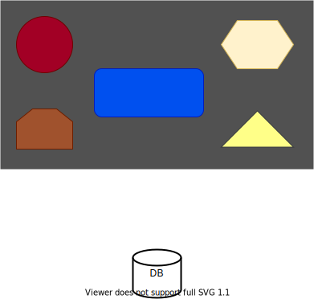
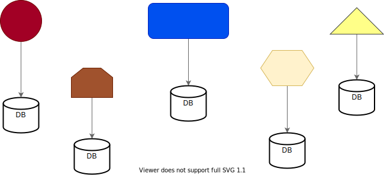

> # <mark>`Microservices Architecture`</mark>

# Microservices Architecture

> 6.  ### Decentralized data management

`Traditional systems have a single database. And this single database stores all the system data from all the components.`

-   Usually a typical traditional system looks like this  

  

 

-   We can see here that the system has many components, but utilizes only one database used by all the components.

`With microservices, each service has its own database, and typically would look like this:`  

  

 

-   As we can see above, the various components, with which the microservices are implemented as services have their own database.
-   And they are not sharing the database with any other component.

> **Important notes:**

-   This is the most controversial attribute of microservices.
-   It is not always possible.
-   Sometimes, you will face situations where implementing separate database for each service is simply not possible / not making sense.
-   Forcing separate database might cause problems such as distributed transactions, data duplication and more.
    -   As mentioned before, we want to model the services around business capabilities.
    -   This usually entails that each such capability has its own data and this data is not related to other services data.
        And therefore we can actually separate the databases. However, this is not always the case.
    -   For example,
        -   Consider an e-commerce site, we decide to go with microservices. 
            And two of the services are orders management and customers management.
        -   The first one is responsible for handling the orders in the system, such as, adding orders, cancelling orders etc.
        -   And the second service manages the customers, their demographics data, login details and more.
        -   By the looks of it, these two services manage two completely different sets of data, so there should not be a problem to have two separate databases, one for each service.
        -   However, as part of the requirements, we need to display for each customer, how many orders did he / she submitted in the last 6 months.
        -   Now, to save time, we want to store this number as part of the customer data and not calculate it from the orders database.
        -   So, now we have two closely related pieces of data which are stored in two different databases.
        -   And when a new order is created, we first need to add the order record to the order database and then update the number of orders submitted in the customer database.
        -   These two updates must occur in the same transaction. And in updating two databases in a single transaction is always a pain.
        -   This would raise problems by making us use ugly mechanisms such as distributed transaction and two-faced commit, which are extremely fragile and add lot of complexity.
        -   And we end up with a system which is more complicated that a regular monolith with a single database, and we miss the whole idea of microservices.
        -   In addition to all of this, we also have data duplication, meaning the same data, a bit different in representation is duplicated across two databases. We have a number of orders in the orders database and in the customer database.
        -   This is always a bad idea because if one of the database goes out of sync, the data will not be consistent.
    -   To summarize, this is not always possible and as an architect, we should not insist on having separate databases for each service. This should be decided upon a case by case basis.

> **Motivation:**

-   `Right tool for the right task:`
    -   It enables using the right tool for the right task. Not all databases are equal and some databases are better equipped for specific tasks.
    -   For instance, relational databases are great for complex queries of structured data, while NoSQL database are great for storing large amount of semi-structured data.
    -   And in modern systems, we often deal with both types of tasks. so, it's good to have the ability to use the right database for what specifically the service needs.
-   `Encourages isolation:`
    -   Separating the databases encourages isolation.
    -   When the team developing the services knows the service has its own database and there is no access to data stored in other services, the design of the services will become more isolated and less dependent on the data from those services.
    -   This way, we will end up with a more modular system and with more autonomous services that can have changes without effecting other services.

---

[PREV](../03E/03E-decentralized-governance.md)  [NEXT](../03G/03G-infrastructure-automation.md)
