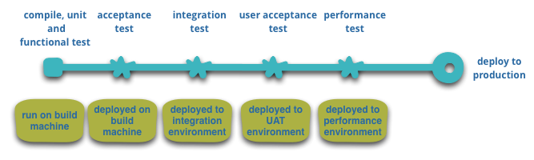

> # <mark>`Microservices Architecture`</mark>

# Microservices Architecture

> 7.  ### Infrastructure automation

`The SOA paradigm suffered from lack of tooling. As a result, many operations that were supposed to be quite quick ended up very slow and affected the project schedule.`

-   This is mainly for testing and deployment, which are major parts in the systems lifecycle.
-   Automated tooling can greatly help in accelerating deployment, exactly in these two areas:
    -   `Automated Testing`
    -   `Automated Deployment`
-   In fact, if we look at a typical project lifecycle as depicted in _Martin Fowler's_ [article](https://martinfowler.com/articles/microservices.html)  

  

     
    <small>
      <b>Image source: <b>
      <a href="https://martinfowler.com/articles/microservices.html">Martin Fowler's article</a>
    </small>
  
 

-   We can see there are a lot of steps that when automated can take the whole deployment process to a whole new level.
-   True, though this depiction zoomed at five types of tests, in the real world the number is usually lower.
-   But still, whatever types of testing you employ, automating it will make it complete much faster.

`For microservices, automation is essential.`

-   There are a lot of moving parts and manually testing and deploying each one of them will slower the process substantially, making it extremely inefficient.
-   With microservices, short deployment cycles are a must. And actually it's one of the keys to a successful system.
-   This means that deployment and testing can be done manually and we must utilize tools for that.
-   And actually, there are quite a lot of automation tools like:  

  

 

-   These are some of the automation tools, that can greatly help you automate the microservice testing deployment.
-   Of course, you as an architect should not be responsible for choosing and integrating the tools.
-   But you do have to make sure there are automation tools and that the testing and deployment are not be done manually.

> **Motivation:**

-   `Short deployment cycles:`
    -   As we can guess, our main motivation is short deployment cycles.
    -   In fact, without infrastructure automation, your microservices project will likely fail.
    -   It won't be easy to achieve short deployment cycles when done manually.
    -   And if done manually, it will take much longer that the more traditional monolith application.

---

[PREV](../03F/03F-decentralized-data-management.md)  [NEXT](./03G-infrastructure-automation.md)
