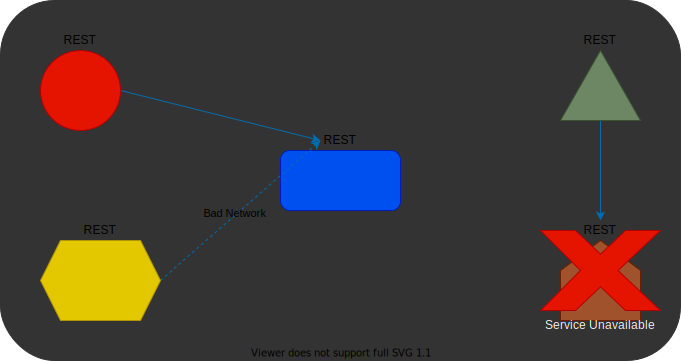

> # <mark>`Microservices Architecture`</mark>

# Microservices Architecture

> 8.  ### Design for Failure

`With microservices there are a lot of processes and a lot of network traffic, which means, a lot can go wrong.`

-   A process can crash
-   Network can go down

When there are a lot of moving parts the probability that one part will not function properly naturally increases.

`How to deal with this?`

-   By writing the code in such a way that it assumes failure can and will happen and it will handle it gracefully.
-   For example:

    -   If the code calls another service, it should assume the service is down. So, when an error occurs, it won't throw an unhandled exception, but will try to mitigate it.  

    

 

    -   Extensive logging and monitoring should be in place, to catch the errors and raise alerts when they happen.

`What should the code do?`

-   First, catch the exception. Do not allow an unhandled exception to bubble all the way to the client. It will just confuse the user and might expose sensitive data.
-   Next, it might be a good idea to retry the connection.
-   If nothing else works, log the exception so that the developers will be aware of it and analyze it later.
-   Another element that should be put in place is `monitoring`.
    -   With monitoring, there is another service, usually a third-party product monitoring the services.
    -   This product is continuously monitoring the services for problems and is looking at various data about the services.
    -   For Example:
        -   Looks at the CPU and RAM of the machines underlying the services.
        -   Also, makes checks to be sure that the services are up and running.
    -   When a monitor detects a problem, it knows to raise alerts, either to the dedicated console or to other messaging services such as email or text.

> **Motivation:**

-   `Increase system's reliability`
    -   Not surprisingly, the main motivation here is to increase the system's reliability.
    -   If the system is able to handle the errors gracefully, it will experience less crashes and will provide better user experience.

---

[PREV](../03G/03G-infrastructure-automation.md)  [NEXT](./03H-design-for-failure.md)
